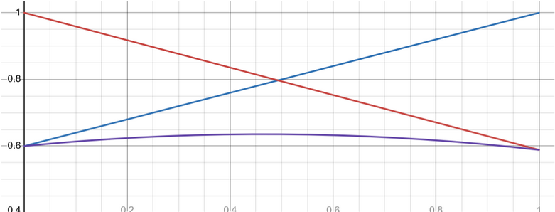
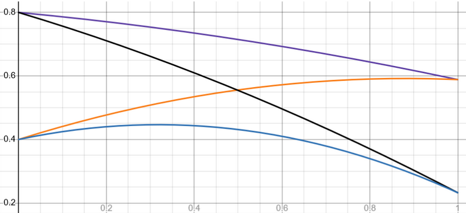
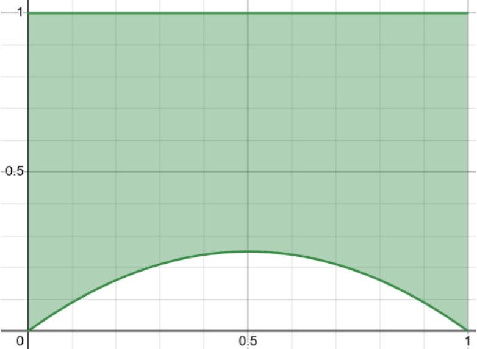
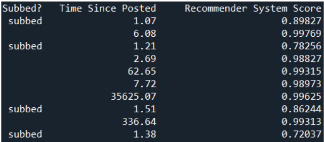
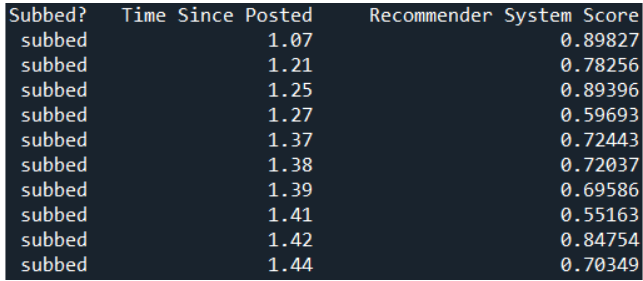
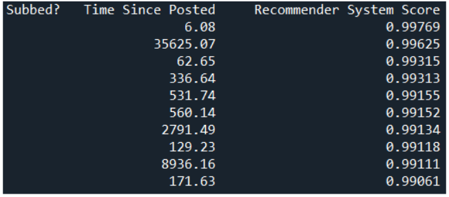
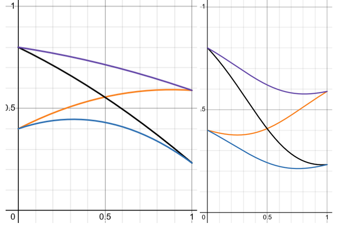

# Sliders for recommender Systems

### Goal:
The goal of this project is to add agency to youtube’s recommended page by adding customisation options for the video feed. Right now, youtube gives you videos that are most similar to videos you have watched in the past. This makes it difficult to expand the types of videos you watch. There is a recommended tab that shows you whatever videos youtube thinks are similar to those you watch, and there is your subscription tab that shows you chronologically the videos from people you have subscribed to. I would like to make a system with 3 sliders. One that changes the proportion of subscribed vs not subscribed, one that changes the weighting of score vs recency of unsubscribed videos, and one that changes the weighting of score vs recency of subscribed videos.

### Context
Recommender systems are all around us in services such as Netflix, Instagram, and Spotify. Recommender systems are a type of algorithm that tries to help people find what they are looking for among a rapidly increasing amount of options. However, these systems are often unknown, with no way to change the way this algorithm recommends options for you.

A major issue on these sites is getting stuck with the same type of recommendations that you interacted with at one point. The platform I will focus on is youtube. If you watch one type of video for a day or two the same videos can be recommended for weeks. The site also has a subscription tab, but does not show all videos from people you have subscribed to.

### Existing AI
Input:

User preference (selected when making an account)
User interactions
Watches
Likes
Shares
Cookies/trackers - information from third party sites

Output:

A series of recommended posts

Rules:

Group user with similar people
Recommend posts that people similar to you like
Also recommend some posts with less confirmation to see if they would be liked in your ‘group’

Validation:

Training data can be split up into data to train, data to test model fit, and validation data
User interactions with recommended posts is another form of validation

### Ethical analysis
Recommender systems have almost no agency for the users of the system. Users have no real choices that influence loss function or other features of the recommender system. The only real choices are to interact with the suggestion, ignore it, or block it. 
This is a clear ethical issue, as these days social media is used by many for things like staying in touch with friends, interacting with a hobby, or job networking. The inability to have any real agency in recommender systems means people are at the mercy of an unknown algorithm in these cases.

The way I plan to add agency to this system is by adding two options. One that dictates the percent of posts that are new. If you only had your followed accounts posts (and this setting maxed), it would show them chronologically. If you only had random it would do the same, which would effectively be random.
The other dictates the percent of posts from people you follow vs people you don’t. This would effectively allow you to choose the amount of new users recommended to you. A combination of these would allow many choices in your post recommendation.

### Proposed AI
Input:

User preference (selected when making an account)
User interactions
Watches
Likes
Shares
Cookies/trackers - information from third party sites
An option to change the percent of not followed posts 
This would mean you would get the posts from random people less similar to you than normal
An option to change the percent of ‘most recent’ posts compared to recommended posts.
This would only show the most recent posts if maxed. If not maxed at all, all posts would be done using the standard recommendation protocol

Output:

A series of recommended posts

Rules:

Group user with similar people
Pick a random percent, if below the ‘not followed’ percent ignore users followed, otherwise only look at users followed
Pick a random percent, if below the ‘most recent’ percent take the most recent post, otherwise use the typical loss function to determine the best post.
Recommend posts that people similar to you like
Remove the most similar posts depending on what people specify
Also recommend some posts with less confirmation to see if they would be liked in your ‘group’

Validation:

Training data can be split up into data to train, data to test model fit, and validation data
User interactions with recommended posts is another form of validation

## Prototype design of AI
### How to use code

Near the top of the document there are 3 sliders,  prop_subbed, time_slider, and sub_time_slider. prop_subbed changes the proportion of subbscribed videos, time_slider changes the weighting of time compared to the recommender system score for unsubscribed videos, and sub_time_slider does the same as time_slider, but for subscribed videos.

When the code is run, a false dataset of videos is generated. 5 random "categories" for each video get a value between 0 and 1 (the user gets one in each category too); then a cosine similarity between the user's score in these categories and the videos is preformed to generate a score for the video. In reality this score would use the site's recommendation algorithm to rank the videos. This score is then adjusted by the equation described below. The system then randomly pick either a subscribed or unsubscribed video (by using prop_subbed) and takes the video with the highest adjusted score and recommends it.

The system recommends 10 videos, then waits for input, if "q" it quits, if anything else, it recommends 10 more videos.

### Theory
The prototype of this design modifies the recommender system score by applying the following equation:

S_adj=(Slider+(1-Slider)S)*(1-Slider+Slider/(log(offset+t)/log(10)+ζ))
Where 0≤Slider≤1 is the slider the user interacts with, S is the recommender system score before the sliders act, S_adj is the adjusted score, t is the time since posted, offset is an offset to the time, and ζ is a “damping” term for the equation.

The first term in this equation (Slider+(1-Slider)S) linearly interpolates between the recommender system’s score and 1. If Slider=1, this first term is 1 and if Slider=0 this first term is S. The second term (1-Slider+Slider/(log(offset+t)/log(10)+ζ)) linearly interpolates between 1 and the score based off of time posted. These are then multiplied, seen in Figure 1.

offset  is important as if a video was just posted t=0 would be undefined, and if 0<t1, log would blow up to a very large negative number. ζ is important as if log(offset+t) is close to zero, Slider/(log(offset+t)/log(10)) would blow up to infinity, meaning the actual score would be meaningless for just posted videos.

4 videos scores with different values of the slider can be seen in Figure 2. This shows how the slider affect video ranking. Figure 3 shows the possible scores for the equation.

Figure 1: S=0.6, t=4, toffset=1, ζ=1: Example of score changes for the slider changing from 0 to 1. First term is blue, the second is red, and the product is purple. 

Figure 2: Examples of four videos with S=0.4 or S=0.8, and t=4 or t=2000  for the slider changing from 0 to 1. 

Figure 3: Possible range of values reachable by the function.

These sliders allow the users to customise the feed to whatever preferred. Some example of output are shown in Figures 4, 5, and 6. Figure 4 shows a mix of slider values, while Figure 5 and Figure 6 show recovery of the subscription feed and homepage, respectively. This Allows these two seperate pages to be merged into 1 while increasing agency of the user.

Figure 4: Proportion of subbed videos is 0.5, time slider is 0.02, subbed time slider is 0.9. This gives unsubbed videos little dependence on time posted and subbed videos little dependence on score.

Figure 5: Recovery of subscription feed by setting proportion of subbed videos to 1 and subbed time slider to 1. This gives only subbed videos chronologically.

Figure 6: Recovery of recommended feed by setting proportion of subbed videos to 0 and time slider to 0. This gives only un-subbed videos according to their similarity score.

### Problems with Proposed Solution and possible solutions

The log scale for time might be too sensitive for small values of time while being too insensitive for larger values of time. Another function could be used to map time to a domain in [0,1]. A maximum value of time could cap all times to do this, i.e. another above 10 years old, just consider it 10 years old for the purposes of recommendation.

The slider also does not make intuitive sense to most people; what does a 0.2 on the scale mean? What about 0.5? The slider would have to be tweaked to feel more natural, and simplifications to the formula could be made to make explanation of the slider more natural.

The function does not map to every value from zero to 1 for every slider value. If the slider is at 0.5, the minimum adjusted score is 0.25. The function could have Slider(1-Slider) subtracted and then have the result divided by (1+Slider(Slider-1)). This gives the result in Figure 7. The function could also be changed to linearly interpolate between the score and time value, which could also increase the clarity of the slider.

Figure 7: Comparison between base function and function adjusted to have scores between 0 and 1.

Finally there is the issue of if users feel this gives them more agency. I feel like I have more options by doing this as it is exactly what I feel is missing in Youtube’s system. There would need to be test group to test if this does increase agency, but that is beyond the scope of this project.

## Annotated Bibliography
Podcast transcript 
https://towardsdatascience.com/ethical-problems-with-recommender-systeems-398198b5a4d2
‘Time Horizon’ - time that posts have a positive effect
People who care about the product
end users 
systems themselves
Balance satisfaction with testing new products
the companies 
Separate care about long term satisfaction
Wider society
Recommender systems change the people who use them, these people then interact with others
Desire to be ‘improved’ and ‘grow’
AI does shape the people who use it, but not necessarily in a good way

Study on ethical concerns of recommender systems
https://su.diva-portal.org/smash/get/diva2:1784468/FULLTEXT01.pdf 
People familiar and concerned with major issues. Main concerns are:
privacy (don’t care if recommendations are worse)
Spread of Fake News

HOW NEW?

